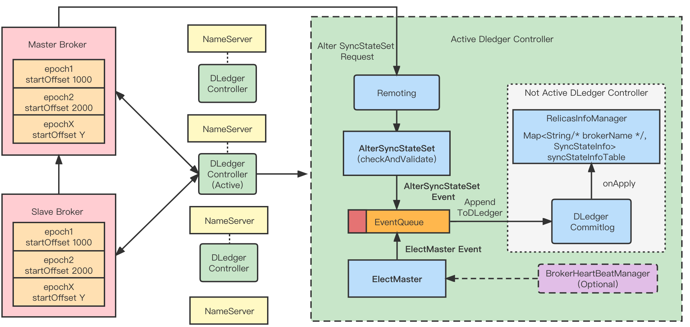

# 背景

当前 RocketMQ Raft 模式主要是利用 DLedger Commitlog 替换原来的 Commitlog，使 Commitlog 拥有选举复制能力，但这也造成了一些问题：

- Raft 模式下，Broker组内副本数必须是三副本及以上，副本的ACK也必须遵循多数派协议。
- RocketMQ 存在两套 HA 复制流程，且 Raft 模式下的复制无法利用 RocketMQ 原生的存储能力。

因此我们希望利用 DLedger 实现一个基于 Raft 的一致性模块（DLedger Controller），并当作一个可选的选主组件, 支持独立部署, 也可以嵌入在 Nameserver 中，Broker 通过与 Controller 的交互完成 Master 的选举, 从而解决上述问题, 我们将该新模式称为 Controller 模式。

# 架构

## 核心思想


如图是 Controller 模式的核心架构, 介绍如下:

- DledgerController: 利⽤ DLedger ，构建⼀个保证元数据强⼀致性的 DLedger Controller 控制器，利⽤ Raft 选举会选出⼀个 Active DLedger Controller 作为主控制器，DLedger Controller 可以内嵌在 Nameserver中，也可以独立的部署。其主要作用是, 用来存储和管理 Broker 的 SyncStateSet 列表, 并在某个 Broker 的 Master Broker 下线或⽹络隔离时，主动发出调度指令来切换 Broker 的 Master。
- SyncStateSet:  主要表示⼀个 broker 副本组中跟上 Master 的 Slave 副本加上 Master 的集合。主要判断标准是 Master 和 Slave 之间的差距。当 Master 下线时，我们会从 SyncStateSet 列表中选出新的 Master。 SyncStateSet 列表的变更主要由 Master Broker 发起。Master通过定时任务判断和同步过程中完成 SyncStateSet 的Shrink 和 Expand，并向选举组件 Controller 发起 Alter SyncStateSet 请求。
- AutoSwitchHAService:  一个新的 HAService, 在 DefaultHAService 的基础上, 支持 BrokerRole 的切换, 支持 Master 和 Slave 之间互相转换 (在 Controller 的控制下) 。此外, 该 HAService 统一了日志复制流程, 会在 HA HandShake 阶段进行日志的截断。
- ReplicasManager: 作为一个中间组件, 起到承上启下的作用。对上, 可以定期同步来自 Controller 的控制指令, 对下, 可以定期监控 HAService 的状态, 并在合适的时间修改 SyncStateSet。ReplicasManager 会定期同步 Controller 中关于该 Broker 的元数据, 当 Controller 选举出一个新的 Master 的时候, ReplicasManager 能够感知到元数据的变化, 并进行 BrokerRole 的切换。


## DledgerController 核心设计



如图是 DledgerController 的核心设计:

- DLedgerController 可以内嵌在 Namesrv 中, 也可以独立的部署。
- Active DLedgerController 是 DLedger 选举出来的 Leader, 其会接受来自客户端的事件请求, 并通过 DLedger 发起共识, 最后应用到内存元数据状态机中。
- Not Active DLedgerController, 也即 Follower 角色, 其会通过 DLedger 复制来自 Active DLedgerController 的事件日志, 然后直接运用到状态机中。

## 日志复制

### 基本概念与流程

为了统一日志复制流程, 区分每一任 Master 的日志复制边界, 方便日志截断, 引入了 MasterEpoch 的概念, 代表当前 Master 的任期号 (类似 Raft Term 的含义)。

对于每一任 Master, 其都有 MasterEpoch 与 StartOffset, 分别代表该 Master 的任期号与起始日志位移。

需要注意的是, MasterEpoch 是由 Controller 决定的, 且其是单调递增的。

此外, 我们还引入了 EpochFile, 用于存放 <Epoch, StartOffset> 序列。

**当⼀个 Broker 成为 Master，其会:**

- 将 Commitlog 截断到最后⼀条消息的边界。

- 同时最新将 <MasterEpoch , startoffset> 持久化到 EpochFile, startOffset 也即当前 CommitLog 的 MaxPhyOffset 。

- 然后 HAService 监听连接，创建 HAConnection，配合 Slave 完成流程交互。

**当一个 Broker 成为 Slave, 其会:**

Ready 阶段：

- 将Commitlog截断到最后⼀条消息的边界。

- 与Master建⽴连接。

Handshake 阶段：

- 进⾏⽇志截断，这⾥关键在于 Slave 利⽤本地的 epoch 与 startOffset 和 Master 对⽐, 找到⽇志截断点，进⾏⽇志截断。

Transfer 阶段:

- 从 Master 同步日志。

### 截断算法

具体的日志截断算法流程如下:

- 在 HandShake 阶段,  Slave 会从 Master 处获取 Master 的 EpochCache 。

- Slave ⽐较获取到的 Master EpochCahce <Startoffset，Endoffset>，从后往前依次和本地进行比对, 如果二者的 Epoch 与 StartOffset 相等,  则该 Epoch 有效，截断位点为两者中较⼩的 Endoffset，截断后修正⾃⼰的<Epoch , Startoffset> 信息，进⼊Transfer 阶 段；如果不相等，对比 Slave 前⼀个epoch，直到找到截断位点。

```
slave：TreeMap<Epoch, Pair<startOffset,endOffset>> epochMap;
Iterator iterator = epochMap.entrySet().iterator();
truncateOffset = -1;

//Epoch为从⼤到⼩排序
while (iterator.hasNext()) {
    Map.Entry<Epoch, Pair<startOffset,endOffset>> curEntry = iterator.next();
    Pair<startOffset,endOffset> masterOffset=
    findMasterOffsetByEpoch(curEntry.getKey());
    
    if(masterOffset != null && 
            curEntry.getKey().getObejct1() == masterOffset.getObejct1()) {
        truncateOffset = Math.min(curEntry.getKey().getObejct2(), masterOffset.getObejct2());
        break;
   }
}
```

### 复制流程

由于 Ha 是基于流进行日志复制的, 我们无法分清日志的边界 (也即传输的一批日志可能横跨多个 MasterEpoch), Slave 无法感知到 MasterEpoch 的变化, 也就无法及时修改 EpochFile。

因此, 我们做了如下改进:

Master 传输⽇志时，保证⼀次发送的⼀个 batch 是同⼀个 epoch 中的，⽽不能横跨多个 epoch。可以在WriteSocketService 中新增两个变量：

- currentTransferEpoch：代表当前 WriteSocketService.nextTransferFromWhere 对应在哪个 epoch 中

- currentTransferEpochEndOffset: 对应 currentTransferEpoch 的 end offset.。如果 currentTransferEpoch == MaxEpoch，则 currentTransferEpochEndOffset= -1，表示没有界限。

WriteSocketService 传输下⼀批⽇志时 (假设这⼀批⽇志总⼤⼩为 size)，如果发现

nextTransferFromWhere + size > currentTransferEpochEndOffset，则将 selectMappedBufferResult limit ⾄ currentTransferEpochEndOffset。 最后，修改 currentTransferEpoch 和 currentTransferEpochEndOffset ⾄下⼀个 epoch。

相应的， Slave 接受⽇志时，如果从 header 中发现 epoch 变化，则记录到本地 epoch⽂件中。

### 复制协议

根据上文我们可以知道, AutoSwitchHaService 对日志复制划分为多个阶段, 下面介绍是该 HaService 的协议。

#### Handshake 阶段

1.AutoSwitchHaClient (Slave) 会向 Master 发送 HandShake 包, 如下:

```
current state + Two flags + slaveAddressLength + slaveAddress
```

- Current state 代表当前的 HAConnectionState, 也即 HANDSHAKE。

- Two falgs 是两个状态标志位, 其中, isSyncFromLastFile 代表是否要从 Master 的最后一个文件开始复制, isAsyncLearner 代表该 Slave 是否是异步复制, 并以 Learner 的形式接入 Master。

- slaveAddressLength 与 slaveAddress 代表了该 Slave 的地址, 用于后续加入 SyncStateSet 。

2.AutoSwitchHaConnection (Master) 会向 Slave 回送 HandShake 包, 如下:

```
current state + body size + offset + epoch + body
```

- Current state 代表当前的 HAConnectionState, 也即 HANDSHAKE。
- Body size 代表了 body 的长度。
- Offset 代表 Master 端日志的最大偏移量。
- Epoch 代表了 Master 的 Epoch 。
- Body 中传输的是 Master 端的 EpochEntryList 。

Slave 收到 Master 回送的包后, 就会在本地进行上文阐述的日志截断流程。

#### Transfer 阶段

1.AutoSwitchHaConnection (Master) 会不断的往 Slave 发送日志包, 如下:

```
 current state + body size + offset + epoch  + epochStartOffset + additionalInfo(confirmOffset) + body
```

- Current state 代表当前的 HAConnectionState, 也即 Transfer 。
- Body size 代表了 body 的长度。
- Offset 当前这一批次的日志的起始偏移量。
- Epoch: 代表当前这一批次日志所属的 MasterEpoch。
- epochStartOffset: 代表当前这一批次日志的 MasterEpoch 对应的 StartOffset。
- confirmOffset: 代表在 SyncStateSet 中的副本的最小偏移量。
- Body: 日志。

2.AutoSwitchHaClient (Slave) 会向 Master 发送 ACK 包:

```
 current state + maxOffset.
```

- Current state 代表当前的 HAConnectionState, 也即 Transfer 。
- MaxOffset: 代表当前 Slave 的最大日志偏移量。

## Master 选举

### 基本流程

ELectMaster 主要是在某 Broker 副本组的 Master 下线或不可访问时，重新从 SyncStateSet 列表⾥⾯选出⼀个新的 Master，该事件由 Controller ⾃身发起。

无论 Controller 是独立部署, 还是嵌入在 Namesrv 中, 其都会监听每个 Broker 的连接通道, 如果某个 Broker channel inActive 了, 就会判断该 Broker 是否为 Master, 如果是, 则会触发选主的流程。

选举 Master 的⽅式⽐较简单，我们只需要在该组 Broker 所对应的 SyncStateSet 列表中，挑选⼀个出来成为新的 Master 即可，并通过 DLedger 共识后应⽤到内存元数据，最后将结果通知对应的Broker副本组。

### SyncStateSet 变更

SyncStateSet 是选主的重要依据, SyncStateSet 列表的变更主要由 Master Broker 发起。Master通过定时任务判断和同步过程中完成 SyncStateSet 的Shrink 和 Expand，并向选举组件 Controller 发起 Alter SyncStateSet 请求。

#### Shrink

Shrink SyncStateSet ，指把 SyncStateSet 副本集合中那些与Master差距过⼤的副本移除，判断依据如下:

- 增加 haMaxTimeSlaveNotCatchUp 参数 。

- HaConnection 中记录 Slave 上⼀次跟上 Master 的时间戳 lastCaughtUpTimeMs，该时间戳含义是：每次Master 向 Slave 发送数据（transferData）时记录⾃⼰当前的 MaxOffset 为 lastMasterMaxOffset 以及当前时间戳 lastTransferTimeMs。

- ReadSocketService 接收到 slaveAckOffset 时若 slaveAckOffset >= lastMasterMaxOffset 则将lastCaughtUpTimeMs 更新为 lastTransferTimeMs。

- Master 端通过定时任务扫描每一个 HaConnection, 如果 (cur_time - connection.lastCaughtUpTimeMs) > haMaxTimeSlaveNotCatchUp，则该 Slave 是 Out-of-sync 的。

- 如果检测到 Slave out of sync , master 会立刻和 Controller 上报, 从而 Shrink SyncStateSet。

#### Expand

如果⼀个 Slave 副本追赶上了 Master，Master 需要及时向Controller Alter SyncStateSet 。加⼊SyncStateSet 的条件是 slaveAckOffset >= ConfirmOffset（当前 SyncStateSet  中所有副本的 MaxOffset 的最⼩值）。